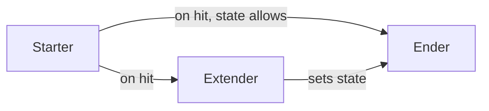

# Combat Prototype – Design Document

Single source of truth for the isometric action-RPG combat prototype and a **learning roadmap**: each system points to the Godot concepts and docs you’ll use so you can implement and learn as you go.

---

## 1. Vision and high-level idea

**Isometric action-RPG where skills can be canceled or chained like fighting-game combos.**

- **Cancel on hit:** From certain skills (e.g. starters), the player can cancel into another skill when the attack connects.
- **Multi-use skills:** Skills have more than one use (e.g. different timings, ranges, or follow-ups).
- **Discoverable combos:** Combos emerge from rules and enemy state (hitstun, airborne, stunned), not from a fixed list—the player experiments to find routes.
- **Mix archetypes:** The player equips skills from different archetypes (e.g. 2 Sword, 1 Lightning, 1 Martial Arts) and finds strategies and combos that mix them.

---

## 2. Scope (what’s in / out)

**In scope**

- Player movement (snappy, optional walk/run, optional run-cancel on some skills).
- Player skills (attacks) with hitboxes and cancel/combo rules.
- Combo system driven by skill roles and enemy state.
- Minimal enemies (red capsules) that can move and use physics so they react to hits.
- Attack visuals via **VFX** (particles, shaders)—no attack sprites or models.
- Optional simple SFX for hits and skills to sell impact.

**Out of scope**

- RPG mechanics: no stats, levels, inventory, or progression.
- Fancy art: player is a blue capsule, enemies are red capsules.
- Attack sprites or character models for attacks; visuals are primarily procedural (particles, shaders).

**Existing content**

- Arena and props live in [scenes/main.tscn](scenes/main.tscn) and [sample/Mini Arena/Models/](sample/Mini Arena/Models/) (GLB models).
- The **player and enemies are capsules added to this scene**; the sample models are environment only.

---

## 3. Current project state

- **Engine:** Godot 4.6, 3D, Forward+ renderer.
- **Main scene:** [scenes/main.tscn](scenes/main.tscn) has:
  - Root `Node3D`
  - `WorldEnvironment` (sky, ambient, SSAO, glow)
  - `CSGBox3D` floor (100×0.001×100)
  - `View` (Node3D) with `Camera3D` (isometric-style angle)
  - `DirectionalLight3D` (shadows)
  - `Sample` node with props (banner, column, trees, bricks, statue) from the Mini Arena GLBs
- **No player, no combat, no combat scripts yet.**

**Starting point for implementation:** Add a player (blue capsule) and test enemies (red capsules) to this scene, then hook up input and scripts for movement and one skill.

---

## 4. Controls

| Input | Action |
|-------|--------|
| **W A S D** | Movement |
| **LMB** | Skill slot 1 |
| **RMB** | Skill slot 2 |
| **1** | Skill slot 3 |
| **2** | Skill slot 4 |
| **3** | Skill slot 5 |
| **4** | Skill slot 6 |

**Implementation note:** Use Godot’s **Input Map** (Project → Project Settings → Input Map) and define actions (e.g. `move_left`, `move_right`, `move_forward`, `move_back`, `skill_1` … `skill_6`) so scripts stay clear and rebinding is easy later.

---

## 5. Combat feel (pillars)

Goals for the prototype, in order of importance:

1. **Movement**  
   Snappy and satisfying. Optional: different speeds for walk vs run; some skills can be run-canceled.

2. **Multi-use skills**  
   Every skill has more than one use (e.g. different ranges, timings, or follow-up inputs).

3. **Discoverable combos**  
   Combos come from rules and enemy state (hitstun, airborne, stunned), not a fixed list. The player discovers routes by experimenting.

4. **Skill mixing**  
   Player can equip skills from different archetypes (e.g. 2 Sword, 1 Lightning, 1 Martial Arts) and find strategies and combos that mix them.

5. **Skill roles (tags)**  
   - **Starters:** Fast, weak, some utility; **cancel on hit into any other skill**. Min 1, max ~2.  
   - **Extenders:** Set up combos or enders (knock up, status, spacing). Min 1, max ~2–3.  
   - **Enders:** Require enemy state (e.g. shocked, airborne, stunned), or are slow/hard to land, or cost a resource. Min 1, max ~2.

### Example: Rock throw (multi-use + combo)

- **Press once:** Rock rises out of the ground quickly.  
  - **Close range:** Rising rock hits the enemy and **launches them (knock-up)** → player can juggle with other skills.  
  - **No second press:** Use the rise only as a launcher for air combos.
- **Press again (before or after rise):** Throw the rock as a **ranged projectile**.

So the same skill is: **ranged poke** or **close-range launcher for juggles**. Combos are discoverable (e.g. rise → launch → air skills → ender).

---

## 6. Skill system (design only)

**Archetypes (target by end of prototype)**

- Sword  
- Elemental (e.g. lightning, earth)  
- Martial Arts  
- Knives / Daggers  

**Target:** At least **3 skills per archetype** (12+ skills total). Each skill has a **role** (starter / extender / ender) and optional **state requirements** (e.g. “enemy must be airborne”).

**Combo logic (conceptual)**

- **Starters** can cancel on hit into any other skill.
- **Extenders** set enemy state (launch, stun, etc.) so enders or further extenders can connect.
- **Enders** require enemy state (e.g. airborne, stunned) or are situational (slow, hard to space); they may consume state or a resource.

No specific damage values, cooldowns, or frame data here—those are for tuning later.

**Combo flow (overview)**

- **Starter** (on hit) → can go to **any** Extender or Ender (if state allows).
- **Extender** (on hit) → sets enemy state (e.g. airborne) → allows **Ender** that requires that state.

---

## 7. Enemies

**Prototype**

- **Red capsules** only.
- Can **move** and use **physics** (e.g. `CharacterBody3D` or `RigidBody3D`) so they react to hits and knockback.
- No complex AI for first pass: static dummies or simple “move toward player” is enough.

**Enemy state** (e.g. airborne, stunned, normal) is what extenders and enders depend on. The combo system reads this state to allow or block certain skills.

---

## 8. Audio

**Scope:** Simple **SFX for hits and skills** to sell impact. No music or full mix specified.

**Implementation:** Godot’s [AudioStreamPlayer3D](https://docs.godotengine.org/en/stable/classes/class_audiostreamplayer3d.html) (or 2D) and [AudioStream](https://docs.godotengine.org/en/stable/tutorials/audio/audio_streams.html) (WAV/OGG). Import sounds in the project and play them when hits connect or skills trigger.

---

## 9. VFX (attack visuals)

**Approach:** Prefer **particles and shaders** over sprites or models so the prototype stays asset-light and you learn VFX.

- **Particles:** [GPUParticles3D](https://docs.godotengine.org/en/stable/classes/class_gpuparticles3d.html) (or [CPUParticles3D](https://docs.godotengine.org/en/stable/classes/class_cpuparticles3d.html) for learning), with [ParticleProcessMaterial](https://docs.godotengine.org/en/stable/classes/class_particleprocessmaterial.html). Use for slashes, impacts, projectiles, etc.
- **Shaders:** [ShaderMaterial](https://docs.godotengine.org/en/stable/classes/class_shadermaterial.html) on meshes or decals for simple trails, flashes, or screen-space effects.

**Docs to learn from**

- [3D particles](https://docs.godotengine.org/en/stable/tutorials/3d/particles/index.html)  
- [Shaders](https://docs.godotengine.org/en/stable/tutorials/shaders/index.html)  

---

## 10. Learning and implementation guide

Use this section as a **learning roadmap**: for each system, you know what to use in Godot and where to read in the docs. Implement in the order below so each step builds on the last.

### Godot concepts per system

| System | What you’ll use in Godot | Docs / concepts to learn |
|--------|---------------------------|---------------------------|
| **Player movement** | `CharacterBody3D`, `Input.get_vector()`, `move_and_slide()`, optional sprint state | [CharacterBody3D](https://docs.godotengine.org/en/stable/classes/class_characterbody3d.html), [Input](https://docs.godotengine.org/en/stable/classes/class_input.html), [InputMap](https://docs.godotengine.org/en/stable/tutorials/inputs/inputevent.html) |
| **Input / controls** | Input Map (Project Settings), action names (e.g. `move_*`, `skill_1` … `skill_6`) | Input system, InputEvent* |
| **Skills (logic)** | Scripts on player or a SkillManager node; state or animation-driven logic; timers for cancel windows | Scenes and scripts, signals, optional [AnimationPlayer](https://docs.godotengine.org/en/stable/classes/class_animationplayer.html) for timing |
| **Hit detection** | `Area3D` (hitboxes) vs `Area3D` or `CharacterBody3D` (hurtboxes); `body_entered` / `area_entered` | [Area3D](https://docs.godotengine.org/en/stable/classes/class_area3d.html), [collision layers and masks](https://docs.godotengine.org/en/stable/tutorials/physics/physics_introduction.html#collision-layers-and-masks) |
| **Combo / cancel rules** | Data (e.g. `can_cancel_into: [all]`, `requires_state: airborne`) and code that checks current skill + enemy state before starting next skill | Your own data (Dictionary or [Resource](https://docs.godotengine.org/en/stable/classes/class_resource.html)) + [signals](https://docs.godotengine.org/en/stable/getting_started/step_by_step/signals.html) |
| **Enemy state** | Variables or state enum on enemy (e.g. airborne, stunned, normal); set by extenders/starters | Same scene/script patterns as player |
| **Attack VFX** | `GPUParticles3D` or `CPUParticles3D`, `ParticleProcessMaterial`; optional `ShaderMaterial` on meshes or decals | [3D particles](https://docs.godotengine.org/en/stable/tutorials/3d/particles/index.html), [Shaders](https://docs.godotengine.org/en/stable/tutorials/shaders/index.html) |
| **SFX** | `AudioStreamPlayer3D` (or 2D), `AudioStream` (WAV/OGG) | [Audio streams](https://docs.godotengine.org/en/stable/tutorials/audio/audio_streams.html) |

### Recommended implementation order

1. **Input Map and movement**  
   Set up actions (WASD, skill_1 … skill_6). Add player as blue capsule with `CharacterBody3D`, use `Input.get_vector()` and `move_and_slide()`. Optional: walk vs run, run-cancel for some skills.

2. **One simple skill**  
   One attack (e.g. single hit) with a hitbox (`Area3D`) and enemy hurtbox; deal “damage” or just detect hit (e.g. print or signal).

3. **Cancel rule**  
   On hit from that skill, allow transitioning to another skill (one starter → one extender or ender). Implement “cancel on hit” window and state check.

4. **Enemy as capsule**  
   Red capsule with physics (`CharacterBody3D` or `RigidBody3D`) and state (e.g. `airborne` flag) so knock-up and enders can be tested.

5. **More skills and roles**  
   Add starters, extenders, enders; implement state requirements (e.g. ender only when enemy is airborne).

6. **VFX pass**  
   Add particles or a simple shader to one skill so you learn the pipeline.

7. **SFX**  
   Add hit and skill SFX using `AudioStreamPlayer3D` and imported WAV/OGG.

---

## What this document does not do

- **Node hierarchy / file layout:** You choose how to structure scenes and folders when implementing.
- **Tuning:** No damage values, cooldowns, or frame data here; that’s a later pass.
- **Implementation:** This doc describes goals, scope, and learning path only; you (or follow-up tasks) implement from it.

---

## Summary

- **One file:** `docs/DESIGN.md` — single source of truth and learning roadmap.
- **Focus:** Combat feel first; minimal everything else (capsules, no RPG, procedural VFX).
- **Skills:** Multi-use, tag-based (starter / extender / ender), 3+ per archetype (Sword, Elemental, Martial Arts, Knives/Daggers).
- **Learning:** Use the table and implementation order above with the linked Godot 4.6 docs to build and learn as you go.
